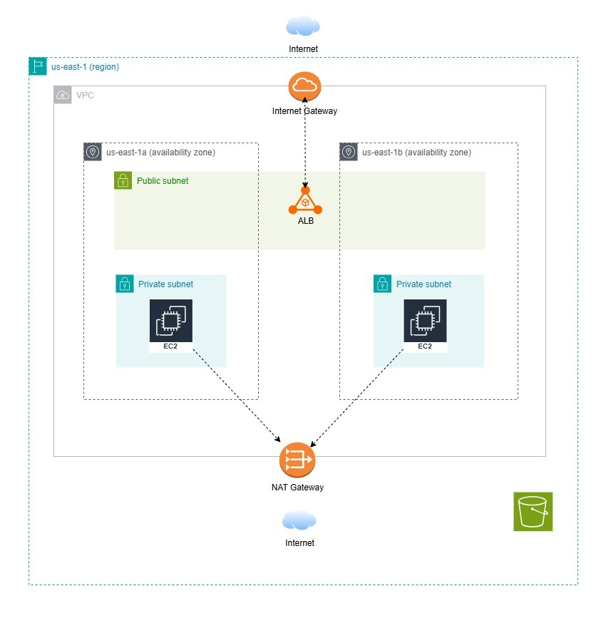

# Terraform AWS Core

Simple AWS Terraform project with two environments (`dev` and `prod`) using reusable modules.

## Architecture

Per environment, this stack now creates:

- 1 VPC
- 2 public subnets (for internet-facing ALB)
- 1 private subnet (for EC2 web server)
- 1 Internet Gateway
- 1 NAT Gateway (private subnet egress)
- 1 Application Load Balancer
- 1 EC2 instance (web server) in private subnet, registered to ALB target group
- IAM Role + Instance Profile for EC2 (with AmazonSSMManagedInstanceCore)
- EC2 key pair support
  - create and manage a key pair from `public_key`
  - or use an existing key pair by name
- Security groups:
  - ALB SG: HTTP/HTTPS from `0.0.0.0/0`
  - Web SG: HTTP only from ALB SG, SSH from configured `ssh_allowed_cidr`
- 1 S3 bucket




## Project layout

```text
.
├── environments
│   ├── dev
│   │   ├── main.tf
│   │   ├── variables.tf
│   │   ├── outputs.tf
│   │   └── dev.tfvars.example
│   └── prod
│       ├── main.tf
│       ├── variables.tf
│       ├── outputs.tf
│       └── prod.tfvars.example
└── modules
    ├── compute   # EC2 + ALB + target group + IAM role/profile + key pair
    ├── network   # VPC + public/private subnets + IGW + NAT + routing
    ├── security  # ALB SG + web SG
    └── storage   # S3 bucket
```


## Usage (terraform.tfvars auto-load)

Use `terraform.tfvars` so Terraform loads variables automatically for `plan/apply/destroy`.

1. Copy and edit environment tfvars:

```bash
cp environments/dev/dev.tfvars.example environments/dev/terraform.tfvars
cp environments/prod/prod.tfvars.example environments/prod/terraform.tfvars
```

2. Run Terraform for dev:

```bash
cd environments/dev
terraform init
terraform plan
```

3. Run Terraform for prod:

```bash
cd environments/prod
terraform init
terraform plan
```

## SSH key notes 

[Read the SSH Detail Guide](doc/SSH-Detail-Guide.md)

In each environment tfvars example, these variables control key behavior:

- `create_key_pair = true` + `public_key` + `key_pair_name`:
  Terraform creates the key pair and uses it for EC2.
- `create_key_pair = false` + `key_pair_name`:
  Terraform uses an already existing key pair.

If your run fails with `InvalidKeyPair.NotFound`, either:

- switch to `create_key_pair = true` and set a valid `public_key`, or
- set `key_pair_name` to a key pair that already exists in that AWS region.

## Notes

- `.tfvars` files are gitignored. Keep real values out of version control.
- For ALB, two public subnets in different AZs are used (`availability_zone_1`, `availability_zone_2`).
- EC2 is intentionally private; access the app via `alb_dns_name` output.
